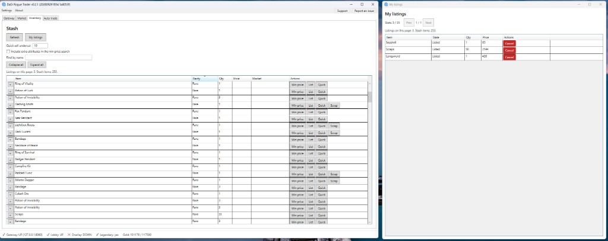
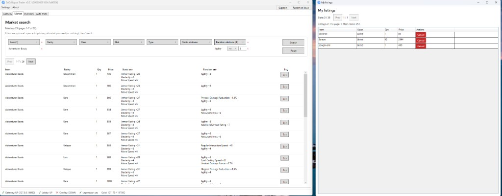

# DaD: Rogue Trader

Торговый асистент для игры Dark and Darker.

[English](README.en.md)

## Основные возможности

- Поиск на рынке по предмету, редкости, классу, слоту, типу и атрибутам, и покупка лота.
- Тайник: минимальная цена, выставление, быстрая продажа и разбор.
- Свои лоты: снятие с продажи и получение золота.
- Оверлей поверх игры показывает минимальную цену по подсказке предмета.
- Автопокупка и флип по сохранённым правилам.
- Локальный шлюз к игре. В режиме dad_proxy сессия лобби держится и после закрытия клиента.

## Скриншоты

Тайник и окно "Мои лоты".

Поиск на рынке по заданным параметрам.

Ветка `master`:

- `manifest.json` - версии программы, контента и списка прокси
- `content/item_labels.json`, `content/attribute_labels.json`, `content/market_filters.json`
- `proxies.json`

Архив не коммитится. Он лежит в GitHub Release у тега из `manifest.json` (`app.tag`, файл `app.file`).

## Минимальные требования

- Windows 10 или новее, 64-bit
- [.NET 10 Desktop Runtime](https://aka.ms/dotnet/10.0/windowsdesktop-runtime-win-x64.exe). В архив он не входит.

Оверлей с распознаванием подсказки использует DirectML и нуждается в видеокарте с DirectX 12.

## Установка и обновление

Скачай последний `DadRogueTrader-win-x64.zip` из [GitHub Release](https://github.com/etspring/dad_rtrader/releases).

1. Поставь runtime из списка выше, если его ещё нет.
2. Распакуй архив в отдельную папку. В корне сразу `DadRogueTrader.exe` и остальные файлы, без вложенной папки.
3. Запусти `DadRogueTrader.exe`.

Чтобы обновить, закрой программу и распакуй новый архив в ту же папку с заменой файлов. Настройки остаются в `%AppData%\DadRogueTrader`.

## Баги и фичи

Если вдруг обнаружен баг или есть идея по улучшению - можно смело писать в [Issues](https://github.com/etspring/dad_rtrader/issues).
